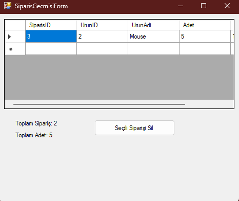

# 🧾 StokTakip - Basit Stok ve Sipariş Takip Uygulaması (C# & MSSQL)

Bu proje, küçük ve orta ölçekli işletmeler için geliştirilen **basit bir stok ve sipariş takip uygulamasıdır**. C# (WinForms) ve MSSQL kullanılarak geliştirilmiştir. Kullanıcılar ürün ekleyebilir, stok miktarlarını görüntüleyebilir, sipariş oluşturabilir ve sipariş geçmişini görüntüleyip silebilir.

---

## 📦 Özellikler

- ✅ Ürün ekleme
- ✅ Ürün stok görüntüleme
- ✅ Sipariş oluşturma ve stoktan otomatik düşme
- ✅ Sipariş geçmişi görüntüleme
- ✅ Sipariş silme ve ana formun otomatik güncellenmesi
- ✅ SQL Server'da `.bak` dosyası ile kolay restore edilebilir yapı

---

## 🛠️ Kurulum ve Kullanım

### 1. Veritabanını Restore Etme

- SQL Server Management Studio (SSMS) ile `StokTakip.bak` dosyasını restore edin:

```sql
-- SSMS içinden:
-- Veritabanları > Geri Yükle > Cihaz > .bak dosyasını seçin ve "StokTakip" adıyla yükleyin.
```

### 2. `DatabaseHelper.cs`'i Düzenleyin

```csharp
private string connectionString = "Server=SUNUCU_ADINIZ;Database=StokTakip;Trusted_Connection=True;";
```

> `SUNUCU_ADINIZ` kısmını kendi bilgisayarınıza göre değiştirin. Örnek: `MONSTER\SQLEXPRESS`

---

## 🖥️ Ekran Görüntüleri

### 📌 Ana Form
> Ürün listesi, stok bilgisi, sipariş verme ve stok güncelleme ekranı


---

### 📌 Sipariş Geçmişi Formu
> Sipariş listesi, sipariş silme ve tarih sırasına göre sipariş görüntüleme ekranı



---

## 🧠 Yapısal Bilgi

### Sınıflar

- **Ürün**
  - Özellikler: `UrunID`, `UrunAdi`, `Stok`
  - Metodlar: `StokGuncelle`, `SiparisOlustur`

- **Sipariş**
  - Özellikler: `SiparisID`, `UrunID`, `Adet`, `Tarih`
  - Metodlar: `Sil`, `Listele`

### SQL Tabloları

- `Urunler (UrunID, UrunAdi, Stok)`
- `Siparisler (SiparisID, UrunID, Adet, Tarih)`

---

## 🧪 Test İçin Öneri

1. Ürün ekleyin.
2. Stok miktarını görüntüleyin.
3. Sipariş verin (stoktan düşer).
4. Sipariş geçmişi formunu açıp silin.
5. Ana form otomatik güncellenir.

---

## 👨‍💻 Geliştirici Notları

- Kod yapısı basit tutulmuştur.
- `DatabaseHelper` sınıfı ile SQL işlemleri merkezileştirilmiştir.
- `Form1` ve `FormSiparisGecmisi` arası veri paylaşımı constructor üzerinden yapılır.
- MessageBox ile kullanıcıdan onay alınır.

---

## 🧳 Lisans

Bu proje eğitim amaçlıdır. İstenildiği gibi geliştirilebilir ve kullanılabilir.
